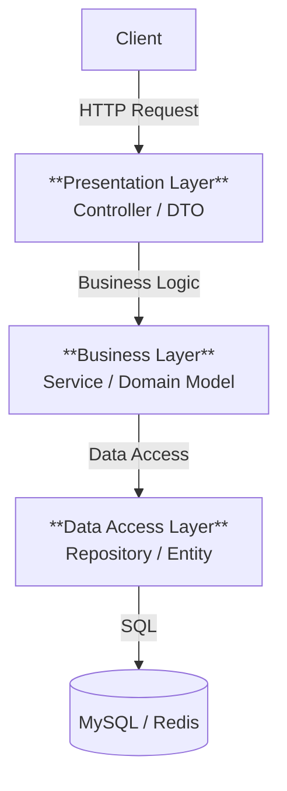
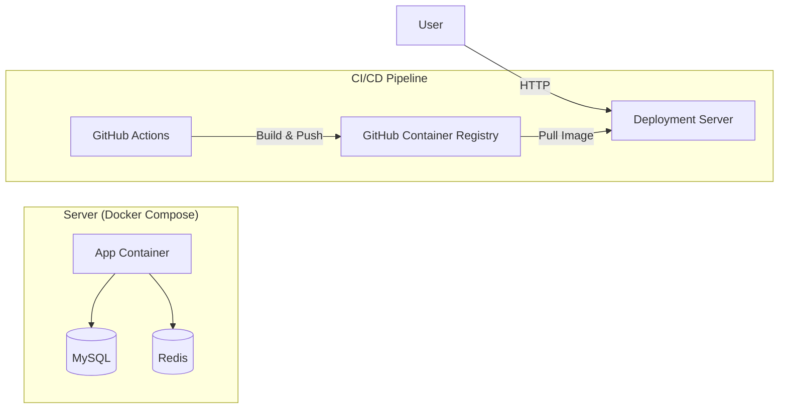

# Architecture Documentation

## 1. 개요
본 문서는 **WSD Community**의 **레이어(Layer)**, **모듈(Module)**, **배포(Deployment)** 구조를 기술합니다.

---

## 2. 레이어 구조 (Layer Structure)
Spring Boot의 표준적인 계층형 아키텍처(Layered Architecture)를 따르며, 각 계층은 명확한 역할과 책임을 가집니다.



### 2-1. Presentation Layer (Controller)
-   **패키지**: `wsd.community.domain.*.controller`
-   **역할**: 클라이언트 요청 수신, 입력값 검증(`@Valid`), API 응답(`CommonResponse`) 반환.
-   **특징**: 비즈니스 로직을 직접 수행하지 않고 Service 계층으로 위임합니다.

### 2-2. Business Layer (Service)
-   **패키지**: `wsd.community.domain.*.service`
-   **역할**: 핵심 비즈니스 로직 수행, 트랜잭션 관리(`@Transactional`), 도메인 객체 상태 변경.
-   **특징**: Controller와 Repository 사이의 의존성을 관리하며, 순수한 비즈니스 로직에 집중합니다.

### 2-3. Data Access Layer (Repository)
-   **패키지**: `wsd.community.domain.*.repository`
-   **역할**: 데이터베이스 CRUD 연산 수행.
-   **기술**: Spring Data JPA(기본 CRUD) 및 QueryDSL(복잡한 동적 쿼리) 활용.

---

## 3. 모듈 구조 (Module Structure)
도메인 주도 설계(DDD)의 사상을 반영하여, 기능(Feature) 단위로 패키지 모듈을 구성했습니다.

```
src/main/java/wsd/community
├── common              # [공통 모듈] 전역 예외 처리, 공통 응답, 유틸리티
├── config              # [설정 모듈] Security, Swagger, Web, QueryDSL 설정
├── infra               # [인프라 모듈] 외부 서비스 연동 (Firebase, S3 등)
└── domain              # [비즈니스 모듈]
    ├── user            # 회원, 인증(Auth), 권한 관리
    ├── post            # 게시글, 좋아요
    ├── comment         # 댓글
    ├── report          # 신고 처리
    └── stats           # 통계 데이터 집계
```

### 주요 모듈 설명
-   **domain**: 비즈니스의 핵심이 되는 모듈로, 하위 패키지에 `controller`, `service`, `repository`, `entity`, `dto`가 응집되어 있습니다.
-   **common**: 모든 모듈에서 공유하는 `ErrorCode`, `GlobalExceptionHandler` 등이 위치합니다.
-   **config**: 애플리케이션의 전반적인 환경 설정을 담당합니다.

---

## 4. 배포 아키텍처 (Deployment Architecture)
CI/CD 파이프라인을 통해 자동화된 배포 프로세스를 구축했습니다.

### 4-1. 시스템 구성도


### 4-2. 컨테이너 구성
| 서비스명 | 이미지 소스 | 포트 | 역할 |
| --- | --- | --- | --- |
| **App** | `ghcr.io/.../community-app` | `80:8080` | Spring Boot 앱 (운영 환경) |
| **DB** | `mysql:8.0` | `3306:3306` | 메인 데이터베이스 |
| **Redis** | `redis:alpine` | `6379:6379` | 캐시 및 세션 저장소 |

### 4-3. CI/CD 프로세스
1.  **CI (GitHub Actions)**: 코드 Push 시 자동 빌드 및 테스트 수행.
2.  **Registry**: 빌드 성공 시 Docker Image가 GHCR에 자동 업로드.
3.  **CD**: 운영 서버에서 최신 이미지를 받아 무중단 배포(Rolling Update) 수행.
