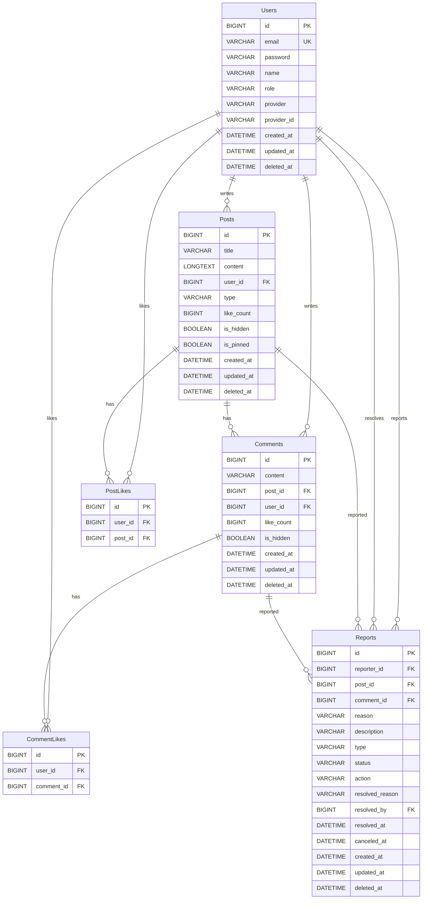

# Database Schema Documentation

## 1. 개요
본 문서는 **WSD Community** 프로젝트의 데이터베이스 스키마 및 엔티티 관계(ERD)를 정의합니다.
MySQL 8.0을 기준으로 작성되었으며, Flyway를 통해 버전 관리됩니다.

---

## 2. ERD (Entity Relationship Diagram)

---

## 3. 테이블 상세 (Table Details)

### 3-1. Users (사용자)
가입된 사용자 정보를 저장합니다. 소셜 로그인(Google, Firebase) 사용자의 경우 `provider`, `provider_id`가 저장됩니다.

| 컬럼명 | 타입 | Nullable | Default | 설명 |
| --- | --- | --- | --- | --- |
| `id` | BIGINT | N | PK, Auto Inc | 사용자 고유 ID |
| `email` | VARCHAR(255) | N | | 이메일 (로그인 ID) |
| `password` | VARCHAR(255) | Y | | 비밀번호 (소셜 로그인 시 Null) |
| `name` | VARCHAR(255) | N | | 사용자 이름 (닉네임) |
| `role` | VARCHAR(50) | N | | 권한 (`USER`, `ADMIN`, `OWNER`) |
| `provider` | VARCHAR(50) | Y | | 소셜 제공자 (`GOOGLE` 등) |
| `provider_id` | VARCHAR(255) | Y | | 소셜 제공자 식별값 |

### 3-2. Posts (게시글)
사용자가 작성한 게시글 정보를 저장합니다.

| 컬럼명 | 타입 | Nullable | Default | 설명 |
| --- | --- | --- | --- | --- |
| `id` | BIGINT | N | PK, Auto Inc | 게시글 고유 ID |
| `title` | VARCHAR(100) | N | | 제목 |
| `content` | LONGTEXT | N | | 내용 |
| `user_id` | BIGINT | N | FK | 작성자 ID |
| `type` | VARCHAR(50) | N | | 게시글 유형 (`GENERAL`, `QNA`) |
| `like_count` | BIGINT | N | 0 | 좋아요 수 (De-normalization) |
| `is_hidden` | BOOLEAN | N | FALSE | 숨김 여부 |
| `is_pinned` | BOOLEAN | N | FALSE | 상단 고정 여부 |

### 3-3. Comments (댓글)
게시글에 달린 댓글 정보를 저장합니다.

| 컬럼명 | 타입 | Nullable | Default | 설명 |
| --- | --- | --- | --- | --- |
| `id` | BIGINT | N | PK, Auto Inc | 댓글 고유 ID |
| `content` | VARCHAR(1000) | N | | 내용 |
| `post_id` | BIGINT | N | FK | 게시글 ID |
| `user_id` | BIGINT | N | FK | 작성자 ID |
| `like_count` | BIGINT | N | 0 | 좋아요 수 (De-normalization) |
| `is_hidden` | BOOLEAN | N | FALSE | 숨김 여부 |

### 3-4. Reports (신고)
게시글 또는 댓글에 대한 신고 내역을 저장합니다.

| 컬럼명 | 타입 | Nullable | Default | 설명 |
| --- | --- | --- | --- | --- |
| `id` | BIGINT | N | PK, Auto Inc | 신고 고유 ID |
| `reporter_id` | BIGINT | N | FK | 신고자 ID |
| `post_id` | BIGINT | Y | FK | 신고 대상 게시글 ID |
| `comment_id` | BIGINT | Y | FK | 신고 대상 댓글 ID |
| `reason` | VARCHAR(50) | N | | 신고 사유 |
| `type` | VARCHAR(50) | N | | 신고 대상 유형 (`POST`, `COMMENT`) |
| `status` | VARCHAR(50) | N | | 처리 상태 (`PENDING`, `RESOLVED`) |
| `action` | VARCHAR(50) | N | | 처리 조치 (`DELETE`, `BAN_USER` 등) |
| `resolved_by` | BIGINT | Y | FK | 처리자(관리자) ID |

### 3-5. PostLikes (게시글 좋아요)
게시글 좋아요 이력을 저장합니다. (중복 좋아요 방지)

| 컬럼명 | 타입 | Nullable | Default | 설명 |
| --- | --- | --- | --- | --- |
| `id` | BIGINT | N | PK, Auto Inc | 고유 ID |
| `user_id` | BIGINT | N | FK | 사용자 ID |
| `post_id` | BIGINT | N | FK | 게시글 ID |

### 3-6. CommentLikes (댓글 좋아요)
댓글 좋아요 이력을 저장합니다. (중복 좋아요 방지)

| 컬럼명 | 타입 | Nullable | Default | 설명 |
| --- | --- | --- | --- | --- |
| `id` | BIGINT | N | PK, Auto Inc | 고유 ID |
| `user_id` | BIGINT | N | FK | 사용자 ID |
| `comment_id` | BIGINT | N | FK | 댓글 ID |

---

## 4. DDL (Data Definition Language)
`V1__init_schema.sql` 파일을 참조하십시오.
